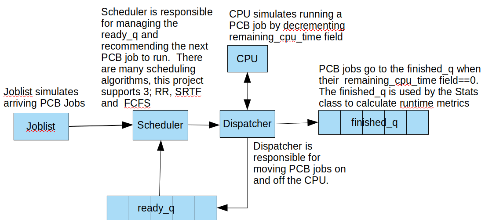
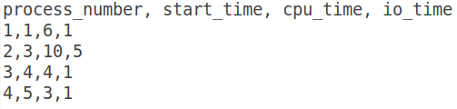
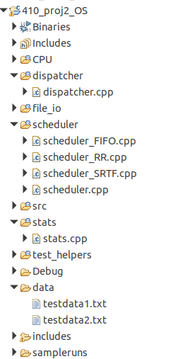

**CPSC 410**

**Project 2 Scheduler Algorithms**

## 

## 

## Overview

You are given most of a project which simulates the process queuing
model shown below.

Your task is to provide the scheduling and dispatch portions of this
code base. Specifically you are responsible for implementing several
scheduling algorithms (Round Robin (RR), Shortest Remaining Time First
(SRTF) and First In First Out (FIFO)), a scheduler base class, a
dispatcher, and Stats, a scheduling metric calculation class.

You are given the header files for all of these classes, so you only
have to provide the implementations for each cpp file. This project
builds off of project 1.

##  

## Teams

**None**: Please work individually on this project.

## File_io (given to you)

You are given a file that has an [unknown number]{.ul} of rows, and 4
columns of integers. Assume there are no malformed rows (ie != 4
columns). It looks like the following.

This file can have any name, but I will call it testdata1.txt for the
purposes of this document. The first row describes what is in each
column of this file and is overlooked by File_io. File_io provides
functions for loading and sorting this data by process arrival time.

## Job List (given to you)

Job list uses File_IO to load jobs to execute. Its purpose is to feed
jobs to the scheduler.

## Scheduler

Please see scheduling header files in includes directory for a
description of the functions to implement. Please place all your
scheduler cpp files in the scheduler directory. This is the only way
your files will compile with my test harness.

## Dispatcher

Please see dispatcher.h header file in includes directory for a
description of the functions to implement. Please place your
dispatcher.cpp file in the Dispatcher directory. This is the only way
your file will compile with my test harness.

## Stats

Please see stats.h header file in includes directory for a description
of the functions to implement. Please place your stats.cpp file in the
stats directory. This is the only way your file will compile with my
test harness.

## Output

The program prints a lot of information to the console to help with
debugging. I will use this output to gauge your programs accuracy. I
will also use different test data than what I provided in the sample
project.

## Documentation and Testing

Make sure you comment each function and the program as a whole. [Please
be mindful of the coding standards on the course projects page.]{.ul}

To help you I have included sample input and corresponding output files
(see data folder). All were run with the defaults given in constants.h.

## Directory Structure

Please provide implementations for the following 6 files

## I will grade

I am going to take your implementation of the following files and drop
them in a cloned project repo. [I will not use any additional files in
your repo.]{.ul}

scheduler_FIFO.cpp

scheduler_RR.cpp

scheduler_SRTF.cpp

scheduler.cpp

stats.cpp file

dispatcher.cpp

## My test setup

Eclipse IDE for C/C++ Developers Version: 2019-06 (4.12.0)

g++ version version 7.4.0

Ubuntu 18.04

## Submission and grading 

I will drop your files into the appropriate places in my project. Then
compile and run.

5% project files correctly submitted

30% scheduler.cpp works correctly

15% scheduler_SRTF.cpp works correctly

10% scheduler_FIFO.cpp works correctly

10% scheduler_RR.cpp.cpp works correctly

20% stats.cpp works correctly

10% dispatcher.cpp works correctly

Please make sure your project compiles before submission otherwise I
will have no way to give you credit.

**[This assignment is complex and is weighted 1.5 times the weight of
project 1]{.ul}**

## Possibly useful information

The project entry point , main() is in .src/410_proj2_OS.cpp

Scheduler is the base class for all the scheduling algorithms. The pure
virtual function sort() makes scheduler an abstract base class(ABC).

Please see the simulate function (in file OS_simulator/simulator.cpp) to
see how the above process queuing model is implemented.

For algorithm SRTF, every time you add a PCB to the ready_q you
[must]{.ul} then call sort to ensure that the shortest remaining time
process is at the front of the line, preempt as necessary.

When calculating timeslices for each process, the timeslice begins when
the PCB has been loaded onto the CPU by the dispatcher.

Make sure you check all pointers for null before dereference. Especially
for the Scheduler ABC. Please be sure the ready_Q is not empty before
trying to access the front item.

## Resources:

A decent overview of OS scheduling;

[[https://en.wikipedia.org/wiki/Scheduling\_%28computing%29#Long-term_scheduling]{.ul}](https://en.wikipedia.org/wiki/Scheduling_(computing)#Long-term_scheduling)

## The OSTEP online text
